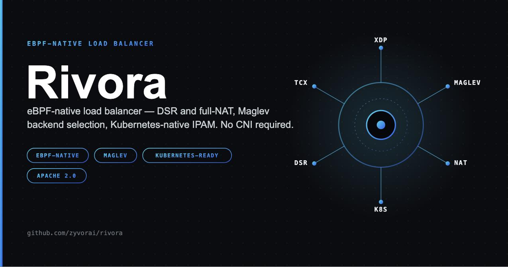

# Rivora

[](https://github.com/zyvorai/rivora/actions/workflows/ci.yml)
[](https://zyvorai.github.io/rivora/)
[](LICENSE)



**eBPF-native load balancing for every environment.**

Rivora is a Layer-4 load balancer that forwards packets in the kernel with XDP. It owns VIPs, backend
selection, health checking and NAT/DSR, for Kubernetes (`Service` of `type: LoadBalancer`, Gateway API) and for
bare metal (a YAML file). It is CNI-independent and does not require Cilium: it attaches its own XDP/TCX
programs and owns its maps under `/sys/fs/bpf/rivora-lb`.

## Highlights

- **Three forwarding modes**, per VIP and mixable on one node: full-NAT, L2 direct server return, and **L3
  direct return** over IP-in-IP or GRE to backends any number of routed hops away.
- **IPv4 and IPv6 as equals**: TCP and UDP, extension headers, fragments, VLAN/QinQ tags, ICMP/ICMPv6 path-MTU
  errors steered to the right backend, sparse `/64` IPAM, dual-stack Services.
- **Weighted Maglev** consistent hashing with graceful draining, per-flow stickiness, `sessionAffinity:
  clientIP`, and per-VIP or node-wide per-source SYN rate limiting.
- **Health checking**: active TCP and HTTP probes, live `drain` and `weight` from the CLI or API.
- **Port ranges and multi-port VIPs** (passive FTP, RTP, game servers).
- **Kubernetes**: Service/EndpointSlice reconciler, `AddressPool` IPAM, the L2 ARP+NDP speaker,
  `externalTrafficPolicy: Local` (with BGP), Gateway API `TCPRoute`/`UDPRoute` with `allowedRoutes` and
  `ReferenceGrant`, and per-Service tuning with `ServicePolicy`. KubeVirt VMs and external IPs work as backends.
- **BGP + BFD** active/active ECMP: health-gated `/32` and `/128` routes, TCP MD5, multihop, graceful restart,
  communities, aggregates, `BGPPeer` resources, and per-Service peer selection.
- **Operable**: config reload without a restart, restart **without a traffic gap** (`-persist-datapath`), adoption
  of the pinned datapath on start, Prometheus metrics (drop reasons, flow-table fill, BGP), a role-based API
  with named keys, an audit trail and mutual TLS, a web console, and a Helm chart plus a `rivora` install CLI.
- **Tested against real traffic**: about twenty network-namespace selftests run in CI, plus unit tests under
  `-race`, with mutation checks on the new behaviour.

> **Status: pre-1.0, and honest about it.** The single-node dataplane, IPv4 and IPv6, all three forwarding modes,
> BGP and the operational features above are implemented and verified by the selftests on a real kernel. The
> Kubernetes Service and IPAM path, KubeVirt and external backends were verified on a live cluster in the early
> releases. **Not yet verified on a real cluster:** the Gateway API traffic path, `ServicePolicy`, `BGPPeer`,
> `externalTrafficPolicy: Local` and restart adoption in Kubernetes mode (tests use fake clients). **Not yet
> verified against a real router:** BGP is tested against gobgp only. **Not measured:** performance.
> **Not possible by design:** L7 routing (`HTTPRoute`, `GRPCRoute`, `TLSRoute`). See
> [Limitations](website/docs/core-concepts/limitations.md) for the complete list.

## Contents

- [How it works](#how-it-works)
- [Forwarding modes](#forwarding-modes)
- [Architecture](#architecture)
- [Quickstart](#quickstart)
- [Kubernetes](#kubernetes)
- [BGP/BFD HA](#bgpbfd-ha)
- [IPv6](#ipv6)
- [What the dataplane handles](#what-the-dataplane-handles)
- [Operating Rivora](#operating-rivora)
- [Securing the API](#securing-the-api)
- [Building and testing](#building-and-testing)
- [Documentation](#documentation)
- [Limitations and roadmap](#limitations-and-roadmap)
- [Repository](#repository)
- [License](#license)

## How it works

- **`bpf/xdp_ingress.c`**, the XDP program: match the VIP, optionally rate-limit new TCP connections per source
  (a per-CPU token bucket; a single array lookup when unconfigured), pick a backend (sticky per flow via
  `connection_affinity_map`, otherwise weighted **Maglev** consistent hashing over `maglev_table`), then forward
  by the VIP's mode. It also steers ICMP errors, follows fragments, and steps over VLAN tags, IPv4 options and
  IPv6 extension headers.
- **`bpf/tc_nat.c`**, the TCX egress program, full-NAT only: turns a backend's reply back into the VIP's
  (source address and port) using the mapping `xdp_ingress` recorded in `nat_reverse_map`.
- **`rivorad`**: the daemon. Loads and pins the BPF objects, programs the maps, builds the Maglev tables, runs
  the health checks, serves the API, web console and metrics, and in Kubernetes mode runs the reconcilers,
  the L2 speaker and the BGP speaker.
- **`rivoractl`**: CLI for `rivorad`'s API: `status`, `vips`, `backends` (add `--format json`), live
  `drain`/`undrain`/`weight`, and `validate FILE` to check a config offline.
- **`rivora-controller`**: leader-elected IPAM and status writer for Kubernetes.
- **`rivora`**: installs, upgrades, inspects and removes Rivora in a cluster, driving the embedded Helm chart
  with no `helm` binary needed.
- **`rivora-doctor`**: host-readiness checker (privileges, kernel, bpffs, tools, API-security settings).

Every command and flag: [Commands, flags and environment](website/docs/operations/cli.md).

## Forwarding modes

| | `nat` | `dsr` | `dsr-ipip` / `dsr-gre` |
| --- | --- | --- | --- |
| Forward path | Rewrite destination address and port, `XDP_PASS` | Rewrite destination MAC, `XDP_TX` | Wrap in an IP-in-IP or GRE tunnel, route with the FIB |
| Replies | **Through the balancer** (un-NATed by TCX egress) | Backend to client directly | Backend to client directly |
| Backends need | Their route back to go through the balancer | To be on the balancer's L2 segment, with the VIP on `lo` and their MAC configured | A tunnel endpoint and the VIP on `lo`; **any number of routed hops away** |
| Kubernetes VIPs | **Yes (the only mode)** | Static config | Static config |

Full-NAT needs nothing on the backends and preserves the client address. DSR keeps the balancer out of the
return path. L3 DSR lifts DSR's same-segment requirement at the cost of 20 to 44 bytes of MTU; XDP cannot
fragment, so an oversize packet is answered with "fragmentation needed" / "packet too big" and the client's
path-MTU discovery adapts. Details: [Forwarding modes](website/docs/core-concepts/forwarding-modes.md).

## Architecture

Two ways to get a VIP into the dataplane, one code path underneath:

```text
  static-YAML path                     Kubernetes path
  ----------------                     ---------------
  rivorad -config                      rivora-controller (leader-elected)
       |                                 AddressPool IPAM; Service/Gateway status
       v                                        |
  internal/config                       rivorad -kubernetes (every node)
       |                                 Service + EndpointSlice reconciler
       |                                 Gateway / TCPRoute / UDPRoute reconciler
       |                                 ServicePolicy, BGPPeer
       |                                        |
       |                               internal/speaker (Lease): ARP + NDP
       |                               internal/bgp: /32 and /128 routes
       |                                        |
       +--------------> internal/dataplane <----+
                     UpsertVIP / RemoveVIP
               ID allocators, health, adoption
                               |
                     BPF maps  /sys/fs/bpf/rivora-lb
                               |
                xdp_ingress  --->  tc_nat (full-NAT replies)
                               |
                            backends
```

A node runs static-YAML VIPs **or** Kubernetes-managed VIPs, not both. The packet path, the maps and how
restarts are handled: [Architecture](website/docs/core-concepts/architecture.md).

## Quickstart

Rivora needs a real Linux kernel (XDP/eBPF, TCX for full-NAT on 6.6+). From a Mac, see
[Building and testing](#building-and-testing) for the remote path.

```sh
make bpf build                      # bpf/*.o and bin/{rivorad,rivoractl,rivora-doctor,rivora-controller,rivora}
sudo ./bin/rivora-doctor            # confirm the host is ready
sudo ./bin/rivorad -config config/examples/single-vip.yaml -bpf-dir bpf
./bin/rivoractl status
```

A minimal full-NAT config:

```yaml
interface: eth0
vips:
  - address: 10.0.0.100
    port: 80
    protocol: tcp
    mode: nat
    backends:
      - {address: 10.0.1.11, port: 8080}
      - {address: 10.0.1.12, port: 8080}
```

Examples in [`config/examples/`](config/examples), all validated by CI:

| File | Shows |
| --- | --- |
| `single-vip.yaml`, `single-vip-nat.yaml` | One VIP, DSR and full-NAT |
| `single-vip-ipv6-dsr.yaml`, `single-vip-ipv6-nat.yaml` | IPv6 |
| `multi-vip.yaml` | Several VIPs, mixing modes |
| `weighted-backends.yaml` | Unequal traffic shares |
| `session-affinity.yaml` | `sessionAffinity: clientIP` |
| `http-healthcheck.yaml` | HTTP probes |
| `rate-limited.yaml`, `vip-rate-limit.yaml` | Node-wide and per-VIP SYN limits |
| `port-ranges.yaml` | Port ranges and multiple ports |
| `l3-dsr.yaml` | IP-in-IP and GRE direct return |
| `bgp-ha.yaml`, `bgp-options.yaml` | BGP + BFD and its options |
| `remote-api.yaml` | An API bound to a non-loopback address |

With more than one VIP, `rivoractl status` and `backends` answer with an error; use `rivoractl vips` (or
`/api/v1/vips`). Every setting: [Configuration reference](website/docs/operations/configuration.md).

## Kubernetes

Install with the [Helm chart](deploy/helm/rivora) or the `rivora` CLI, hand it an `AddressPool`, and any
Service of `type: LoadBalancer` gets an address, is programmed on every node, and is announced by ARP/NDP or
BGP:

```sh
# the rivora CLI: a prebuilt binary (see Releases), or `make build-cli`
curl -fsSL https://raw.githubusercontent.com/zyvorai/rivora/main/scripts/install-cli.sh | bash

rivora install --set rivorad.interface=eth0 \
  --set addressPools[0].name=default \
  --set addressPools[0].addresses='{10.0.0.0/24}'
rivora status
rivora upgrade --set addressPools[1].name=v6 --set addressPools[1].addresses='{2001:db8:1::/64}'
rivora uninstall

# equivalent with helm
helm install rivora deploy/helm/rivora --namespace rivora-system --create-namespace \
  --set rivorad.interface=eth0 --set addressPools[0].name=default --set addressPools[0].addresses='{10.0.0.0/24}'
```

The chart installs `rivorad` (a privileged host-network DaemonSet), `rivora-controller` (two replicas, one
leader), the three CRDs, RBAC, and any `AddressPool`s you seed. The `rivora` CLI embeds the exact chart it
shipped with. **Helm never upgrades CRDs**: on an upgrade, `kubectl apply -f deploy/helm/rivora/crds/` first.
Full reference: [Helm chart](website/docs/kubernetes/helm.md) and the [chart README](deploy/helm/rivora/README.md).

**What a Service gets.** One VIP per `(address, port, protocol)`. Backends are its *ready* endpoints of the
VIP's address family (a terminating endpoint stays as *draining*), forwarded in full-NAT, probed with a TCP
connect unless a `ServicePolicy` says otherwise. `sessionAffinity: ClientIP` is honoured. `externalTrafficPolicy:
Local` is honoured with BGP on and the L2 speaker off, and otherwise treated as `Cluster` with a warning.
`rivora.zyvor.dev/address-pool` picks a pool, `spec.loadBalancerIP` an address.

**Custom resources** (`rivora.zyvor.dev/v1alpha1`, see the [CRD reference](website/docs/kubernetes/crds.md)):

| Kind | Scope | Purpose |
| --- | --- | --- |
| `AddressPool` | Cluster | Where addresses come from: CIDRs, ranges, IPv4 and IPv6 (a `/64` allocates sparsely) |
| `ServicePolicy` | Namespaced | Per-Service health probe, per-source SYN limit, endpoint weights per node, BGP communities and peers ([guide](website/docs/kubernetes/service-policy.md)) |
| `BGPPeer` | Cluster | A BGP neighbour with password Secret, multihop, graceful restart and a node selector |

**Restarts.** A restarted `rivorad` adopts the datapath the pinned maps still hold, keeps forwarding, and
reclaims its VIPs as the reconcilers catch up; VIPs whose Service was deleted while it was down are removed
once the first pass completes. Add `-persist-datapath` and there is no traffic gap at all.

### Backends beyond Pods

The reconciler reads only EndpointSlice addresses, conditions and ports, so no special casing is needed for:

- **KubeVirt VMs**: a normal Service selecting the VMI's labels produces an ordinary EndpointSlice.
- **External or physical IPs**: a Service with no selector plus a hand-written EndpointSlice labelled
  `kubernetes.io/service-name: <service>`.

Both were verified against a live cluster. Not supported: a VM's secondary (Multus) interface.

### Gateway API

`rivorad -kubernetes -gateway-api` (and `rivora-controller -gateway-api`) reconciles `GatewayClass`, `Gateway`
and the experimental-channel L4 routes `TCPRoute` and `UDPRoute`. Addresses come from the same `AddressPool`s
and go into `Gateway.status.addresses`; `backendRefs[].weight` maps onto weighted Maglev. A `TCPRoute` attaches
to a `TCP` listener and a `UDPRoute` to a `UDP` one; routes from other namespaces attach where a listener's
`allowedRoutes` says so, and a `backendRef` into another namespace needs a `ReferenceGrant`.
`rivora-controller` writes per-parent `Accepted` and `ResolvedRefs` conditions on routes and
`attachedRoutes`/`supportedKinds` on listeners.

**`HTTPRoute`, `GRPCRoute` and `TLSRoute` are out of scope**: the dataplane has no L7 visibility, so it cannot
match paths, headers or SNI, and claiming to would be a correctness hazard. Use a `TCPRoute` for TLS
passthrough. **Verification:** start-up, informer sync and `GatewayClass` creation were confirmed on a live
cluster; the traffic path was not (a cluster networking issue blocked it) and the attachment and status logic
is covered by fake-client tests only. See the [Gateway API guide](website/docs/kubernetes/gateway-api.md).

## BGP/BFD HA

With `bgp.enabled` (or `-bgp`) every node **independently** advertises a `/32` (IPv4) or `/128` (IPv6) host
route for each VIP it has a healthy backend for, and withdraws it the moment that stops being true; routers ECMP
across the nodes. Unlike the L2 speaker (one elected node answers ARP/NDP), there is no leader: many nodes
advertising one VIP is the point. Sessions negotiate IPv4 and IPv6 together; BFD is per peer.

```sh
rivorad -kubernetes -interface eth0 \
  -bgp -bgp-asn 65001 -bgp-router-id 10.0.0.11 -bgp-ipv6-next-hop 2001:db8::11 \
  -bgp-peers "10.0.0.1:65000:bfd,10.0.0.2:65000"
```

- **Peer options** (static `bgp.peers`, `-bgp-config` from a Secret, or `BGPPeer` resources): TCP MD5
  password, multihop, graceful restart, BFD, and `nodes` to give each rack its own router.
- **Route attributes**: global and per-VIP communities, local-preference (iBGP), aggregates with optional
  suppression of the covered `/32`s.
- **Per-VIP peer selection**: a VIP's `bgpPeers` (or a `ServicePolicy`'s `spec.bgp.peers`) sends its route to
  only some peers, implemented as a per-neighbour reject rule on gobgp's global export policy.
- **Runtime peers**: `BGPPeer` resources add, change and remove sessions without a restart; only the peer that
  changed is restarted.
- **The caveat, not hidden:** in full-NAT mode, which is the only Kubernetes mode, a flow's state lives on the
  first node that saw it, so a router ECMP re-hash can reset in-flight connections. DSR (static config) does
  not have this problem.
- **Verification:** advertise, withdraw, communities, MD5, multihop across a router, peer changes and route
  limits are tested against real gobgp sessions. **Not** tested against FRR or BIRD or a BFD timing on hardware.

Full guide: [BGP/BFD HA](website/docs/operations/bgp.md).

## IPv6

IPv6 is a peer of IPv4 across the dataplane, IPAM, Kubernetes, L2 announcement and BGP. A VIP's backends must
share its address family.

- **Dataplane**: DSR, full-NAT and L3 DSR for TCP and UDP, with Maglev, affinity, draining, rate limiting and port
  ranges. No IP-header checksum to maintain, and the UDP checksum is never "unset". Hop-by-Hop and Destination
  Options headers are stepped over, fragments follow their first fragment, ICMPv6 errors reach the backend
  that owns the flow.
- **IPAM**: `AddressPool` takes IPv6 CIDRs; prefixes with more than 16 host bits (a `/64`) allocate sparsely by
  randomising host bits instead of enumerating 2^64 addresses.
- **Kubernetes**: dual-stack Services get one VIP per family, with backends filtered to the VIP's family.
- **NDP**: the L2 speaker sends unsolicited NAs and answers Neighbor Solicitations for NAT IPv6 VIPs, falling
  back to ARP-only on an interface without an IPv6 link-local address.
- **BGP**: `/128` advertisement; `bgp.ipv6NextHop` is required.

Details, examples and the verification table: [IPv6](website/docs/core-concepts/ipv6.md). Not yet verified
live: end-to-end dual-stack Service traffic on a cluster, and BGP IPv6 peering against a real router.

## What the dataplane handles

| Traffic | Handling |
| --- | --- |
| TCP and UDP over IPv4 and IPv6 | Balanced, in all three modes |
| VLAN (802.1Q) and QinQ | Stepped over. The tag must be in the frame XDP sees: turn RX VLAN offload off if it is hidden |
| IPv4 options | Balanced |
| IPv4 and IPv6 fragments | First fragment balanced; later fragments follow it, and replies are un-NATed likewise. A fragment arriving *before* its first is lost |
| IPv6 Hop-by-Hop / Destination Options | Stepped over (up to four, 248 bytes). Routing, AH, ESP and longer chains pass through untouched |
| ICMP / ICMPv6 errors quoting a flow | Sent to the backend that owns the flow, so path-MTU discovery works behind a VIP |
| L3 DSR oversize packet | Answered with "fragmentation needed" / "packet too big" so the client adapts |
| Port ranges | LPM-trie lookup after the exact-port lookup; the client's port is kept |
| SCTP, ICMP echo, everything else | Not balanced: passed to the kernel |

The limits are spelled out in the [runbook](website/docs/operations/runbook.md#vlans-fragments-ip-options-and-icmp).

## Operating Rivora

- **Live operations**: `rivoractl drain|undrain ID`, `rivoractl weight ID N [--vip ...]`; not persisted across a
  restart. `rivoractl validate FILE` then `systemctl reload rivorad` (SIGHUP) applies an edited config's VIPs
  without touching unchanged ones.
- **Health checks**: a TCP connect by default; per VIP, `healthCheck: {type: http, path: ..., expectStatus: ...}`
  judges the application, or `port:` probes a separate port (required for UDP and port-range VIPs).
- **Restarts**: `-persist-datapath` pins the XDP/TCX links so the datapath keeps forwarding while `rivorad` is
  down and the next start hot-swaps the program (`rivorad -detach` removes it).
- **XDP mode**: `xdpMode: generic` (default, works anywhere), `native` (in the NIC driver; refuses to start if
  unsupported) or `auto`.
- **Metrics** on `:9871/metrics`: per-VIP and per-backend packets, bytes, health and weight; drop reasons
  (`rate_limited`, `no_healthy_backend`) and `unserved`; flow-table fill; BGP session and route health; API auth
  failures and audited changes. [Metrics and alerts](website/docs/operations/metrics.md) lists them with alert
  rules.
- **Logs**: `-log-level` and `-log-format text|json` on `rivorad` and `rivora-controller`.
- **Runbook**: what to check when a VIP stops answering, when traffic is dropped, when BGP flaps, when a flow
  table fills, and how to restart and upgrade: [Production runbook](website/docs/operations/runbook.md).

## Securing the API

`rivorad`'s API and console listen on `127.0.0.1:9870`, **unauthenticated and plain HTTP**, which is fine for
loopback and not for anything else. All hardening is opt-in through environment variables:

| Variable | Effect |
| --- | --- |
| `RIVORA_API_KEY` | Admin key; setting it turns authentication on. `id:NAME=KEY` names it in the audit log |
| `RIVORA_API_READONLY_KEY` | Read-only key: may read but gets `403` on `drain`/`weight`. Needs the admin key too |
| `RIVORA_TLS_CERT` / `_KEY` | Serve HTTPS with this certificate |
| `RIVORA_TLS_SELF_SIGNED` | Serve HTTPS with a certificate generated at start-up |
| `RIVORA_TLS_CLIENT_CA` | Accept client certificates from this CA (mutual TLS); `RIVORA_API_CERT_ADMIN_CNS` grants admin |

Either key variable takes a comma-separated list for rotation with no outage. `rivorad` refuses to start on an
unsafe combination (a read-only key with no admin key, a key in both roles, a setting holding no usable key).
Every drain, undrain and weight change is logged with the caller's name and counted in
`rivora_api_changes_total`. `scripts/install-systemd.sh` refuses to bind the API to `0.0.0.0` without a key.
Everything, including certificate handling and rotation: [API and console](website/docs/operations/api.md).

## Building and testing

The BPF programs build and load only on Linux; the Go code builds anywhere.

```sh
make bpf build                          # bpf/*.o and bin/*
make test                               # go test ./...   (CI: -race)
make selftest-all                       # every selftest: needs root and a Linux host
make deploy-remote H=<host> U=<user>            # from a Mac: rsync, build and install on a Linux host
make deploy-remote-verify H=<host> U=<user>     # ...and run the selftests there
```

Each `scripts/selftest-*.sh` builds an isolated netns/veth/bridge topology (never touching a host interface),
runs a real `rivorad` in it and drives real traffic, checking for example that a NAT leaves every checksum valid
(with offload off so the receiver verifies), that fragmented datagrams reassemble at both ends, that a restart
under load drops nothing, and that a limit or drop is counted against the right VIP. `make selftest-all` runs
about twenty of them. GitHub Actions runs the Go tests, the selftests, Helm and CRD checks, a kind-based install
test, the console build and a vulnerability scan on every push. What each one proves:
[Selftests and CI](website/docs/operations/selftests-ci.md). Layout and how to change the dataplane:
[Repository, building and testing](website/docs/development/repository.md).

## Documentation

The site is published at **[zyvorai.github.io/rivora](https://zyvorai.github.io/rivora/)** (sources under
[`website/`](website); `make docs-serve` to preview). The pages, in reading order:

| | |
| --- | --- |
| **Getting started** | [Quickstart](website/docs/getting-started/quickstart.md) |
| **Concepts** | [Architecture](website/docs/core-concepts/architecture.md) · [Forwarding modes](website/docs/core-concepts/forwarding-modes.md) · [IPv6](website/docs/core-concepts/ipv6.md) · [Limitations](website/docs/core-concepts/limitations.md) |
| **Kubernetes** | [Overview](website/docs/kubernetes/overview.md) · [Gateway API](website/docs/kubernetes/gateway-api.md) · [Helm chart](website/docs/kubernetes/helm.md) · [CRD reference](website/docs/kubernetes/crds.md) · [ServicePolicy](website/docs/kubernetes/service-policy.md) |
| **Operations** | [Configuration](website/docs/operations/configuration.md) · [Commands and flags](website/docs/operations/cli.md) · [API and console](website/docs/operations/api.md) · [Metrics and alerts](website/docs/operations/metrics.md) · [BGP](website/docs/operations/bgp.md) · [Runbook](website/docs/operations/runbook.md) · [Selftests and CI](website/docs/operations/selftests-ci.md) |
| **Development** | [Repository, building and testing](website/docs/development/repository.md) · [Roadmap](website/docs/roadmap.md) |

## Limitations and roadmap

Read [Limitations](website/docs/core-concepts/limitations.md) before production. In short:

- **By design**: no L7 (HTTP/gRPC/SNI) routing; TCP and UDP only; one interface per node; full-NAT flow state is
  not shared between nodes; Kubernetes VIPs are full-NAT only.
- **Behaviours**: out-of-order fragments are lost; IPv6 Routing/AH/ESP headers are not balanced; L3 DSR needs
  path MTU headroom; health checks are TCP and HTTP only; drains and weight overrides are not persisted; flow
  tables are fixed-size LRUs.
- **Known gap**: `rivoractl status`/`backends`, `/api/v1/status`/`backends` and the console's sign-in check answer
  only when a node has exactly one VIP (use `rivoractl vips`).
- **Unverified**: real-cluster Gateway API traffic, `ServicePolicy`, `BGPPeer` and Kubernetes restart adoption;
  BGP against FRR/BIRD; performance; kernels other than 6.8.

What is done, what is open and what is not planned: [Roadmap](website/docs/roadmap.md).

## Repository

```text
bpf/                    xdp_ingress.c, tc_nat.c, rivora_common.h (hand-rolled: no libbpf headers, no CO-RE)
cmd/rivorad/            per-node daemon: BPF, static-YAML apply, Kubernetes reconcilers, speakers, API
cmd/rivoractl/          CLI for rivorad's API
cmd/rivora/             cluster lifecycle CLI (Helm SDK, embedded chart)
cmd/rivora-controller/  Lease-elected IPAM and status Deployment
cmd/rivora-doctor/      host readiness checker
api/v1alpha1/           AddressPool, ServicePolicy and BGPPeer types (dynamic client, no codegen)
api/gatewayapi/         the minimal Gateway API types Rivora uses
internal/dataplane/     map writer: allocators, UpsertVIP/RemoveVIP, health, adoption, port ranges
internal/bpfmaps/       Go mirrors of the BPF maps' C structs
internal/loader/        BPF load, pin, attach and link persistence (cilium/ebpf)
internal/config/        static-YAML loading and validation
internal/controller/    Service/EndpointSlice reconciler and ServicePolicy
internal/gatewayapi/    Gateway/TCPRoute/UDPRoute reconciler, attachment, status
internal/ipam/ ipamctrl/    address pools and the controller's reconcile logic
internal/speaker/       L2 ARP + NDP responder
internal/bgp/ bgppeers/     gobgp speaker (peer changes, per-peer route limits) and BGPPeer resources
internal/healthcheck/   TCP and HTTP probes
internal/maglev/        weighted Maglev table generation
internal/initsync/      first-pass tracking for startup pruning
internal/api/ apiclient/    HTTP API, auth, audit, embedded console; rivoractl's client
internal/metrics/ logging/ k8s/ installer/ doctor/ tlsutil/    supporting packages
web/                    the console's React source
deploy/helm/rivora/     Helm chart and CRDs (kept in sync with internal/installer/chartdata)
deploy/systemd/         unit and env example for non-Kubernetes deployments
config/examples/        static-YAML examples
scripts/                selftests, deploy-remote.sh, install-systemd.sh, install-cli.sh
website/                the documentation site (Docusaurus)
```

## License

Apache License 2.0. See [LICENSE](LICENSE) and [NOTICE](NOTICE). Report vulnerabilities privately: see
[SECURITY.md](SECURITY.md).
